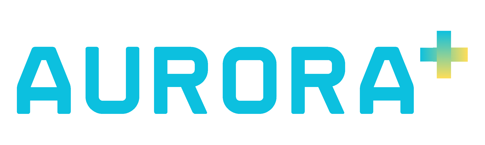

## Introducing Aurora, your all-in-one digital health assistant with a focus on privacy and stigma-free access.

### Stack
- [HeroUI](http://heroui.com/)
- [Tailwind CSS](https://tailwindcss.com/)
- [React](https://react.dev/)
- [Next.js](https://nextjs.org/)

### Requirements

- [Node.js](https://nodejs.org/)

### Installation

Download this repo, extract it in a folder and then run the following commands inside the folder:

```
npm install
```

This will install the dependencies for running the project. Once you have all the dependencies installed, you need to set up the enviroment variables:
There is a `.env.template` file in the repo, you need to change its name to just `.env` and fill it with the following keys:

- `SESSION_KEY`: Key that will be used for signing JWT (authorization tokens), can be a password
- `AI_KEY`: Key for Gemini API from [Google AI Studio](https://aistudio.google.com/apikey)

Once with the enviroment variables ready, you can just run the following command:

```
npm run build && npm run start
```

Then, go to the project's URL, normally http://localhost:3000/ and you're good to go!